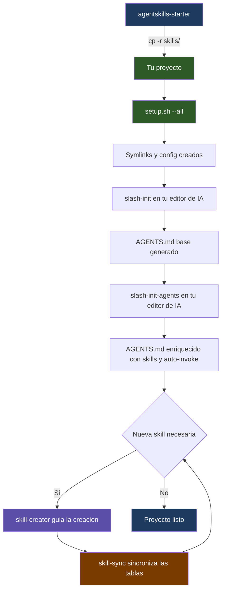
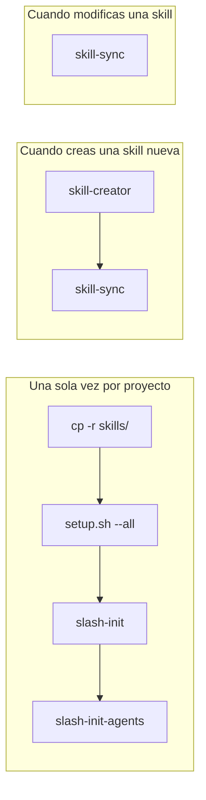
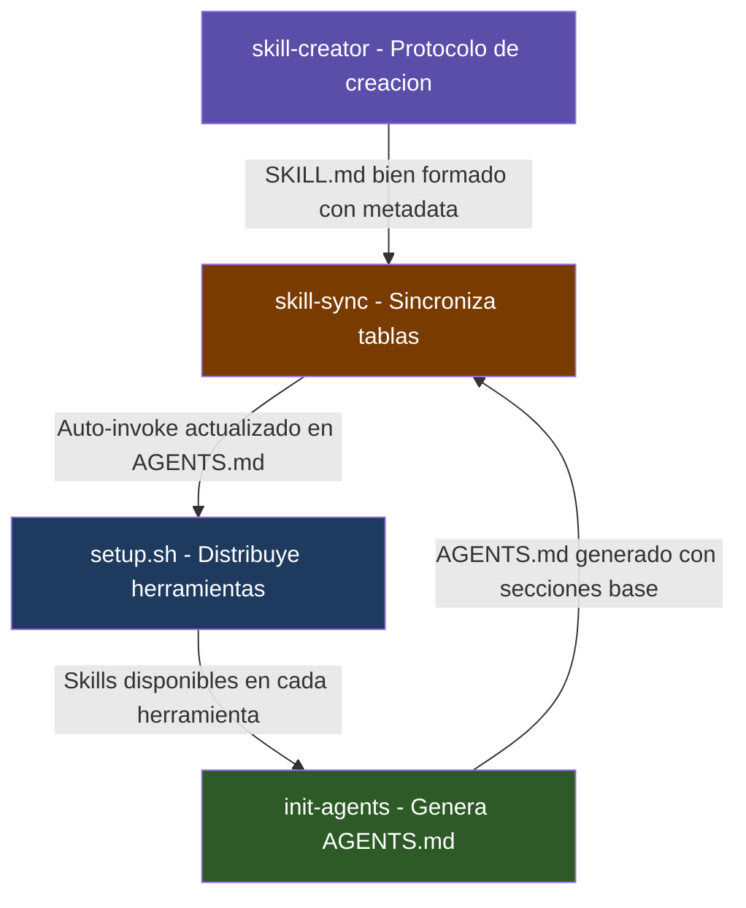

# agentskills-starter

Kit de arranque para configurar agentes de IA en cualquier proyecto.
Generá un `AGENTS.md` de calidad profesional en minutos, con skills, auto-invoke y distribución multi-herramienta.

---

## Cómo funciona



---

## Cuándo usar cada pieza



| Momento                              | Acción                                 | Herramienta      |
| ------------------------------------ | -------------------------------------- | ---------------- |
| Arrancando un proyecto nuevo         | Copiá las skills base                  | `cp -r skills/`  |
| Después de copiar                    | Creá los symlinks para tu editor de IA | `setup.sh --all` |
| Una vez configurado el editor        | Generá el AGENTS.md base               | `/init`          |
| Inmediatamente después               | Enriquecé con skills y auto-invoke     | `/init-agents`   |
| Cuando creás una skill nueva         | Seguí el protocolo correcto            | `skill-creator`  |
| Después de crear/modificar una skill | Actualizá la tabla Auto-invoke         | `skill-sync`     |

---

## Quickstart

### Paso 1 — Copiar las skills a tu proyecto

Descargá este repo y copiá la carpeta `skills/` a la raíz de tu proyecto:

```bash
# Clonar agentskills-starter (una sola vez, donde quieras)
git clone https://github.com/tu-usuario/agentskills-starter.git

# Copiar las skills a tu proyecto
cp -r agentskills-starter/skills/ /ruta/a/tu-proyecto/skills/
```

Eso es todo lo que necesitás de este repo. A partir de acá todo pasa dentro de **tu proyecto**.

---

### Paso 2 — Configurar las herramientas de IA

Desde la raíz de **tu proyecto**, corré el script de setup para que tu herramienta de IA encuentre las skills:

```bash
cd /ruta/a/tu-proyecto

./skills/setup.sh --all       # Todas las herramientas (Claude, Gemini, Codex, Copilot)
./skills/setup.sh --claude    # Solo Claude Code
```

Esto crea los symlinks y archivos de configuración necesarios (`.claude/skills/`, `CLAUDE.md`, etc.).

---

### Paso 3 — Inicializar el AGENTS.md

Dentro de tu editor de IA, ejecutá estos comandos en orden:

```bash
/init           # Genera el AGENTS.md base analizando tu proyecto
/init-agents    # Enriquece el AGENTS.md con skills, auto-invoke y buenas prácticas
```

---

### Paso 4 — Crear skills para tu proyecto

Cuando necesites documentar un patrón o flujo específico de tu proyecto, usá `skill-creator` para guiarte:

```bash
# Dentro de tu editor de IA
# Pedile al agente que cree una skill nueva — él carga skill-creator automáticamente

# Después de crear o modificar cualquier skill, sincronizá las tablas:
./skills/skill-sync/assets/sync.sh
```

---

## Estructura del repo

```
agentskills-starter/
├── README.md                              # Este archivo
├── AGENTS.md                              # Ruleset para agentes de IA
│
└── skills/
    ├── setup.sh                           # Distribuye skills a cada herramienta
    ├── setup_test.sh                      # Tests del script de setup
    │
    ├── init-agents/                       # Genera AGENTS.md para cualquier proyecto
    │   ├── SKILL.md
    │   └── assets/
    │       └── AGENTS-TEMPLATE.md
    │
    ├── skill-creator/                     # Guía para crear nuevas skills
    │   ├── SKILL.md
    │   └── assets/
    │       └── SKILL-TEMPLATE.md
    │
    └── skill-sync/                        # Sincroniza Auto-invoke desde metadata
        ├── SKILL.md
        └── assets/
            └── sync.sh
```

---

## Sinergía entre skills



Cada skill sabe cuándo invocar a las otras:

- **`init-agents`** llama a `skill-sync` después de generar el AGENTS.md
- **`skill-creator`** indica que hay que correr `skill-sync` al terminar
- **`skill-sync`** lee los metadatos (`scope`, `auto_invoke`) de cada SKILL.md
- **`setup.sh`** crea los symlinks para que tu editor de IA encuentre las skills

---

## Compatibilidad

| Herramienta    | Soporte | Mecanismo                         |
| -------------- | ------- | --------------------------------- |
| Claude Code    | ✅      | `.claude/skills/` + `CLAUDE.md`   |
| OpenCode       | ✅      | `.opencode/skills/` + `AGENTS.md` |
| GitHub Copilot | ✅      | `.github/copilot-instructions.md` |
| Gemini CLI     | ✅      | `.gemini/skills/` + `GEMINI.md`   |
| Codex (OpenAI) | ✅      | `AGENTS.md` nativo                |

Las skills siguen el estándar [agentskills.io](https://agentskills.io) — compatibles con múltiples herramientas sin modificaciones.

---

## Metadata requerida en cada SKILL.md

Para que `skill-sync` funcione, cada skill necesita:

```yaml
---
name: mi-skill
description: >
  Descripción de qué hace la skill.
  Trigger: Cuándo invocarla.
version: "1.0"
metadata:
  scope: [root] # root | ui | api | sdk — qué AGENTS.md actualizar
  auto_invoke: "Acción que dispara el auto-invoke"
---
```

`skill-creator` te guía paso a paso para no saltear ningún campo.
