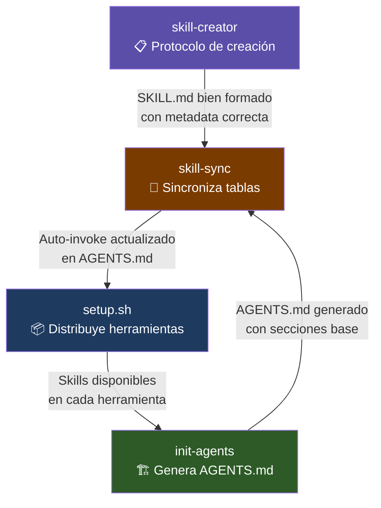

# agent-blueprint

Kit de arranque para configurar agentes de IA en cualquier proyecto.
Generá un `AGENTS.md` de calidad profesional en minutos, con skills, auto-invoke y distribución multi-herramienta.

---

## Cómo funciona

```mermaid
flowchart TD
    A([🆕 Proyecto nuevo]) --> B[/init\nOpenCode o Claude Code]
    B --> C[AGENTS.md base\ngenerado automáticamente]
    C --> D[/init-agents\nskill de este repo]
    D --> E{¿Hay skills en\nskills/ del proyecto?}

    E -- Sí --> F[Detecta stack\ny skills disponibles]
    E -- No --> G[Genera estructura base\ncon TODOs explícitos]

    F --> H[Enriquece AGENTS.md\ncon Skills Reference\ny Auto-invoke table]
    G --> H

    H --> I[skill-sync\nsincroniza Auto-invoke\ndesde metadata de skills]
    I --> J[setup.sh\ndistribuye a herramientas]

    J --> K[Claude Code\n.claude/skills/\nCLAUDE.md]
    J --> L[OpenCode\n.opencode/\nAGENTS.md]
    J --> M[Gemini CLI\n.gemini/skills/\nGEMINI.md]
    J --> N[GitHub Copilot\n.github/\ncopilot-instructions.md]

    style A fill:#1e3a5f,color:#fff
    style D fill:#2d5a27,color:#fff
    style I fill:#2d5a27,color:#fff
    style J fill:#2d5a27,color:#fff
    style K fill:#4a4a4a,color:#fff
    style L fill:#4a4a4a,color:#fff
    style M fill:#4a4a4a,color:#fff
    style N fill:#4a4a4a,color:#fff
```

---

## Cuándo usar cada pieza

```mermaid
flowchart LR
    subgraph INICIO["🚀 Al arrancar un proyecto"]
        A[/init] --> B[/init-agents]
    end

    subgraph SKILLS["🔧 Al crear una nueva skill"]
        C[skill-creator\nvalida estructura y formato]
        C --> D[skill-sync\nactualiza Auto-invoke]
    end

    subgraph DISTRIBUCION["📦 Al compartir con el equipo"]
        E[setup.sh --all\ndistribuye a todas las herramientas]
    end

    subgraph MANTENIMIENTO["🔄 Al modificar una skill existente"]
        F[skill-sync\nresincroniza las tablas]
    end
```

| Momento | Acción | Herramienta |
|---------|--------|-------------|
| Proyecto nuevo | Generá el AGENTS.md base | `/init` (nativo del editor) |
| Inmediatamente después | Enriquecé con skills y auto-invoke | `/init-agents` |
| Cuando creás una skill nueva | Seguí el protocolo correcto | `skill-creator` |
| Después de crear/modificar una skill | Actualizá la tabla Auto-invoke | `skill-sync` |
| Cuando onboarding al equipo | Distribuí a todas las herramientas | `setup.sh --all` |

---

## Quickstart

### 1. Clonar e instalar en un proyecto

```bash
# Clonar este repo en cualquier lugar de tu máquina
git clone https://github.com/tu-usuario/agent-blueprint.git

# Ir al proyecto que querés configurar
cd /ruta/a/tu-proyecto

# Distribuir las skills a tu herramienta de IA preferida
/ruta/a/agent-blueprint/skills/setup.sh --claude    # Solo Claude Code
/ruta/a/agent-blueprint/skills/setup.sh --all       # Todas las herramientas
```

### 2. Inicializar el proyecto

```bash
# Dentro de tu editor de IA (Claude Code, OpenCode, etc.)
/init           # Genera AGENTS.md base con estructura del repo
/init-agents    # Enriquece con skills, auto-invoke y buenas prácticas
```

### 3. Agregar una skill nueva al proyecto

```bash
mkdir -p skills/mi-skill
# Crear skills/mi-skill/SKILL.md siguiendo el protocolo de skill-creator
# Luego sincronizar:
./skills/skill-sync/assets/sync.sh
```

---

## Estructura del repo

```
agent-blueprint/
├── README.md                              # Este archivo
├── AGENTS.md                              # Ruleset para agentes de IA
│
└── skills/
    ├── setup.sh                           # Distribuye skills a cada herramienta
    ├── setup_test.sh                      # Tests del script de setup
    │
    ├── init-agents/                       # Genera AGENTS.md para cualquier proyecto
    │   ├── SKILL.md
    │   └── assets/
    │       └── AGENTS-TEMPLATE.md
    │
    ├── skill-creator/                     # Guía para crear nuevas skills
    │   ├── SKILL.md
    │   └── assets/
    │       └── SKILL-TEMPLATE.md
    │
    └── skill-sync/                        # Sincroniza Auto-invoke desde metadata
        ├── SKILL.md
        └── assets/
            └── sync.sh
```

---

## Sinergía entre skills



Cada skill sabe cuándo invocar a las otras:
- **`init-agents`** llama a `skill-sync` después de generar el AGENTS.md
- **`skill-creator`** indica que hay que correr `skill-sync` al terminar
- **`skill-sync`** lee los metadatos (`scope`, `auto_invoke`) de cada SKILL.md
- **`setup.sh`** es el paso final que lleva todo al proyecto destino

---

## Compatibilidad

| Herramienta | Soporte | Mecanismo |
|-------------|---------|-----------|
| Claude Code | ✅ | `.claude/skills/` + `CLAUDE.md` |
| OpenCode | ✅ | `.opencode/skills/` + `AGENTS.md` |
| GitHub Copilot | ✅ | `.github/copilot-instructions.md` |
| Gemini CLI | ✅ | `.gemini/skills/` + `GEMINI.md` |
| Codex (OpenAI) | ✅ | `AGENTS.md` nativo |

Las skills siguen el estándar [agentskills.io](https://agentskills.io) — compatibles con múltiples herramientas sin modificaciones.

---

## Metadata requerida en cada SKILL.md

Para que `skill-sync` funcione, cada skill necesita:

```yaml
---
name: mi-skill
description: >
  Descripción de qué hace la skill.
  Trigger: Cuándo invocarla.
version: "1.0"
metadata:
  scope: [root]          # root | ui | api | sdk — qué AGENTS.md actualizar
  auto_invoke: "Acción que dispara el auto-invoke"
---
```

`skill-creator` te guía paso a paso para no saltear ningún campo.
